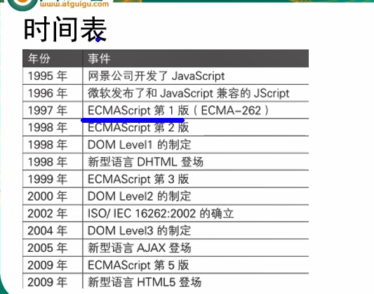
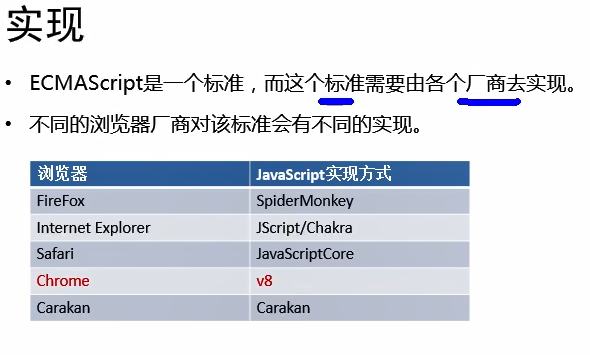
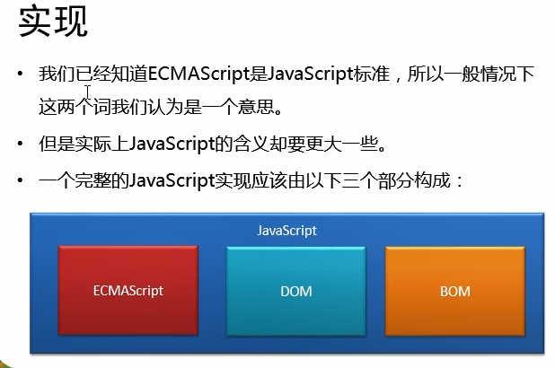
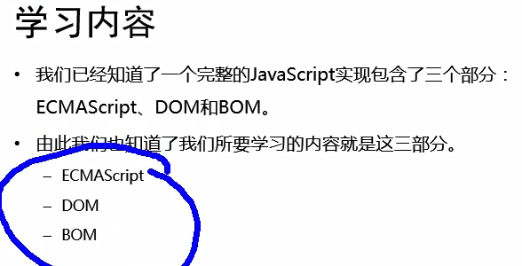
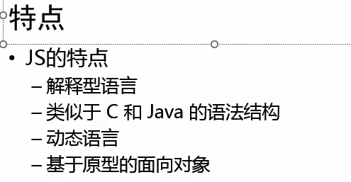
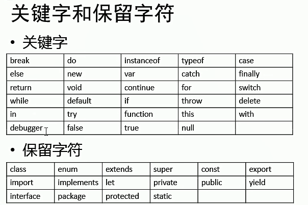

# 欢迎来到JavaScript

## 什么是语言?

- 计算机就是一个由人来控制的机器，人让它干嘛，它就得干嘛。
- ·我们要学习的语言就是人和计算机交流的工具，人类通过语言来控制、操作计算机。
- 编程语言和我们说的中文、英文本质上没有区别，只是语法比特珠

## 语言的发展：

- 纸带机：机器语言

- 汇编语言：符号语言

- 现代语言：高级语言

  

## 起源

- JavaScript诞生于1995年，它的出现出要是用于处理网页前端验证。
- 所谓的前端验证，就是指检查用输入的内容是否符合一宏的规则。
- 比如：用户名的长度，密码的长度，邮箱的格式等。











```html
<!DOCTYPE html>
<html>
	<head>
		<meta charset="UTF-8">
		<title></title>
	</head>
	<script type="text/javascript">
//		JS代码,写在这里
		/*
		 *alert("弹窗") 
		 * 
		 * 让计算机在页面中输出一个内容
		 * document.write()可以向body中输出一个内容
		 * document.write("看我出不出来~~~~~")
		 * 
		 * 向控制台输出一个内容
//		 * console.log("你猜我在哪出来呢")
		 */
		console.log("测试 ")
	</script>
	<body>12222
	</body>
</html>

```

```html
<!DOCTYPE html>
<html lang="en">
<head>
    <meta charset="UTF-8">
    <meta http-equiv="X-UA-Compatible" content="IE=edge">
    <meta name="viewport" content="width=device-width, initial-scale=1.0">
    <title>Document</title>
    <script type="text/javascript">

    </script>
</head>
<body>
    可以将js代码编写到标签的onclick属性中，当我们点击按钮时，js代码就会执行
    <button onclick="alert('讨厌，点我干嘛？')">点击一下</button>
    <!-- 可以将js代码写在超链接的href属性中，这样点击超链接时，会执行js代码 -->
    <a href="javascript:alert('点击有弹窗')">n点击测试</a>
</body>
</html>
```

​		可以将js代码编写到外部的js文件中，然后通过script标签引入，写到外部文件中可以在不同的页面中同时引用，也可以利用到浏览器端缓存机制，推荐使用的方式

​		script标签一旦用于引入外部文件了，就不能在编写代码了，即使编写了浏览器也会自动忽略。如有需要则可以创建一个新的script标签用于编写内部代码

​		可以将js代码编写到标签的onclick属性中
​		当我们点击按钮时，js代码才会执行。

​		虽然写在标签中，但是他们属于结构与行为耦合，不方便维护，不推荐使用。

```html
<!DOCTYPE html>
<html lang="en">
<head>
    <meta charset="UTF-8">
    <meta http-equiv="X-UA-Compatible" content="IE=edge">
    <meta name="viewport" content="width=device-width, initial-scale=1.0">
    <title>Document</title>
    <script type="text/javascript">
         /*
        多行注释
        */

        // 单行注释
        alert('Hello');
        // 页面输出
        document.write('Hello');
        // 控制台输出
        console.log('Hello');

        // js中严格区分大小写
        // js中每一条语句以分号结尾，不写分号，但是系统会自动添加，影响浏览器性能
        // js中自动忽略多个换行和空格，所以我们可以利用空格和换行对代码进行格式化
        
    </script>
</head>
<body>
   
</body>
</html>
```

js中严格区分大小写
js中每一条语句以分号结尾，不写分号，但是系统会自动添加，影响浏览器性能
js中自动忽略多个换行和空格，所以我们可以利用空格和换行对代码进行格式化


```html
<!DOCTYPE html>
<html lang="en">
<head>
    <meta charset="UTF-8">
    <meta http-equiv="X-UA-Compatible" content="IE=edge">
    <meta name="viewport" content="width=device-width, initial-scale=1.0">
    <title>Document</title>
    <script type="text/javascript">
        // 字面量：都是不可改变的值
        // 比如：1 2 3 4 5 6
        // 字面量都可以直接使用，但是我们一般都不会直接使用

        // 1224645584644486
        // 变量：变量可以用保存字面量，而且变量的值是可以直接任意改变的，变量更加方便我们使用
        // x=1145146314536464364
        // 所以在我们开发时都是通过变量去保存一个字面量，较少使用字面量
        var age=80;
        // 可以通过变量对字面量进行描述

        // 声明变量：
        // JS中，用var关键字来声明一个变量
        var a=123;
        a=21514364;
        //为变量赋值
        console.log(a);

        // 声明和赋值同时进行
        var b=4556;
        var c=0;
        console.log(c)

    </script>
</head>
<body>
    
</body>
</html>

```

 字面量：都是不可改变的值

​    比如：1 2 3 4 5 6

​    字面量都可以直接使用，但是我们一般都不会直接使用

​    1224645584644486

​    变量：变量可以用保存字面量，而且变量的值是可以直接任意改变的，变量更加方便我们使用

​    x=1145146314536464364

​    所以在我们开发时都是通过变量去保存一个字面量，较少使用字面量

可以通过变量对字面量进行描述

​    声明变量：

​    JS中，用var关键字来声明一个变量


```html
<!DOCTYPE html>
<html lang="en">
<head>
    <meta charset="UTF-8">
    <meta http-equiv="X-UA-Compatible" content="IE=edge">
    <meta name="viewport" content="width=device-width, initial-scale=1.0">
    <title>Document</title>
    <script type="text/javascript">
        // 标识符：
        // 在JS中所有的可以由我们自己自主命名的都可以称为是标识符
        var aa
        // 例如：
        // 变量名、函数名、属性名都属于标识符
        // 命名一个标识符时需要遵循如下的规则：
        // 1.标识符中可以含有字母、数字、—_、$
        var a_1_$=111;
        // 2.标识符不能以数字开头
        // 3.标识符不能是ES中关键字或保留字
        // var var=1231 错误
        // 4.标识符我们一般采用驼峰命名法
        //     首字母小写，每个单词的开头字母都大写，其余字母小写
        //     helloWorld  xxxYyyZzz

        //     JS底层保存标识符时实际上采用的Unicode编码
        //         所以理论上讲，所有的utf-8中含有的内容都可以做标识符
            var 锄禾日当午=123
            console.log(锄禾日当午);
            // 可以用，容易让人笑话
            
    </script>
</head>
<body>
    
</body>
</html>

```


标识符：

​    在JS中所有的可以由我们自己自主命名的都可以称为是标识符

​    var aa

​    例如：

​    变量名、函数名、属性名都属于标识符

​    命名一个标识符时需要遵循如下的规则：

   		 1.标识符中可以含有字母、数字、—_、$

 		   var a_1_$=111;

   		 2.标识符不能以数字开头

   		 3.标识符不能是ES中关键字或保留字

​			var var=1231 错误



 4.标识符我们一般采用驼峰命名法

- 首字母小写，每个单词的开头字母都大写，其余字母小写

​      helloWorld  xxxYyyZzz

- JS底层保存标识符时实际上采用的Unicode编码

​        所以理论上讲，所有的utf-8中含有的内容都可以做标识符

​      var 锄禾日当午=123

​      console.log(锄禾日当午);

​      可以用，容易让人笑话

